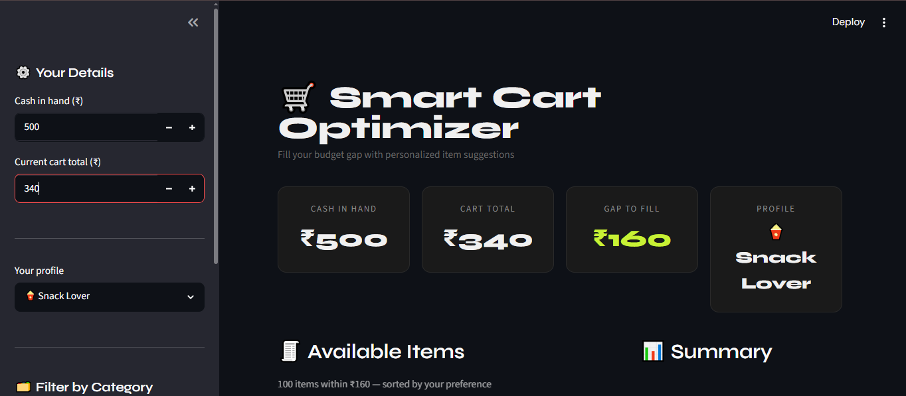
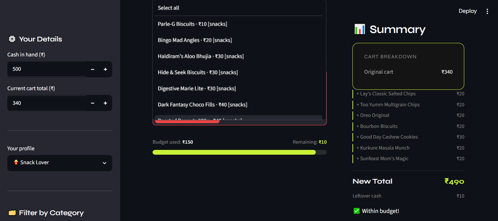
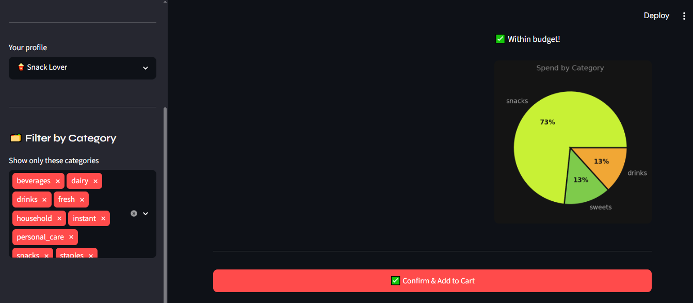

Smart Cart Optimizer

A budget optimization tool that suggests grocery items to add to your cart based on your cash in hand — minimizing leftover change using dynamic programming and personalized ML recommendations.

### Demo

###  Problem
You have ₹500 cash but your cart is only ₹443. Instead of paying with leftover change, the app finds the best items to add that bring your total as close to ₹500 as possible.

### How It Works
1. Enter your cash and current cart total
2. The app calculates the budget gap
3. **0/1 Knapsack DP** finds the optimal item combination within the gap
4. **KNN + Cosine Similarity** reranks suggestions based on your buying profile
5. Pick items, watch the live budget bar update, confirm your cart

### Tech Stack
| Layer | Tools |
|---|---|
| Core Algorithm | 0/1 Knapsack Dynamic Programming |
| ML Recommender | KNN + Cosine Similarity (Scikit-learn) |
| UI | Streamlit |
| Data | Pandas, NumPy |
| Visualization | Matplotlib |

